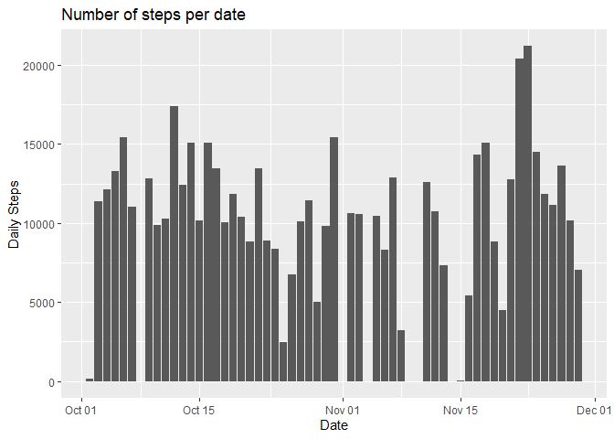
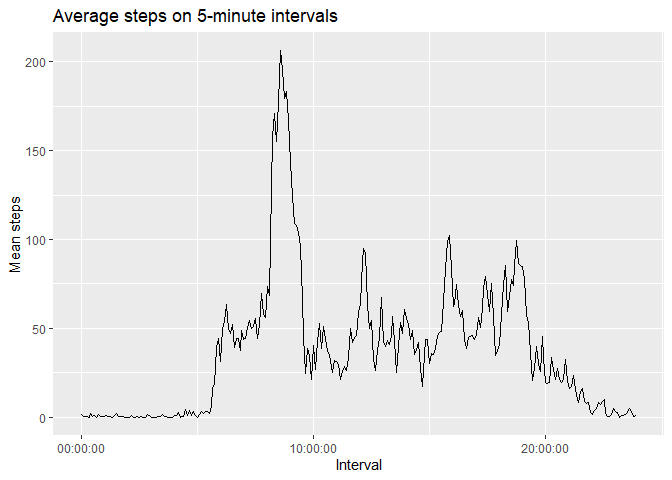
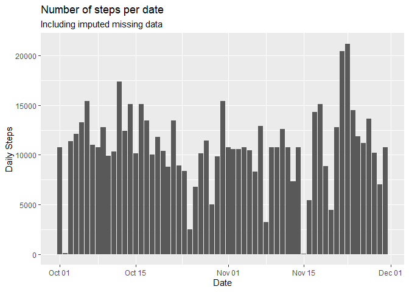
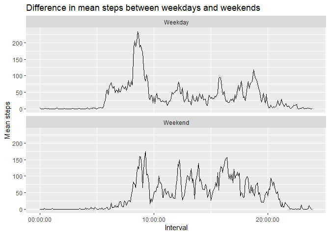

## Loading and preprocessing the data  
The first step of this assignment is to load the data provided in the file "activity.zip" located in the working directory. I chose to use `read_csv` for this operation as it is my default operation for loading rectangular data in the tidyverse. To check if it was loaded correctly, you can examine the first 6 rows of the with `head(data)`.  
By examining the data, it was noted that the `interval` column is stored in military time and needs to be converted to time of day. 

```r
data <- read_csv("activity.zip", show_col_types = FALSE)
data <- data %>% 
     mutate(interval = hms(hours = interval %/% 100, minutes = interval %% 100))
head(data)
```

```
## # A tibble: 6 × 3
##   steps date       interval
##   <dbl> <date>     <time>  
## 1    NA 2012-10-01 00'00"  
## 2    NA 2012-10-01 05'00"  
## 3    NA 2012-10-01 10'00"  
## 4    NA 2012-10-01 15'00"  
## 5    NA 2012-10-01 20'00"  
## 6    NA 2012-10-01 25'00"
```


## What is mean total number of steps taken per day?  
To answer this first question, we want to look at a subset of the data where we ignore the `NA` values. Note that this will remove 2304 rows.  
We first look at the histogram of steps taken per day: 


```r
daily_steps <- data %>%
    filter(!is.na(steps)) %>% # Remove NA values
    group_by(date) %>% # Group by day
    summarize(daily_steps = sum(steps)) # Compute number of steps per day
    
daily_steps %>%
    ggplot(aes(date, daily_steps)) + 
    geom_col() + 
    labs(title = "Number of steps per date", 
         x = "Date", 
         y = "Daily Steps")
```

<!-- -->

We can now compute the mean and median steps per day: 


```r
summary_daily_steps <- daily_steps %>%
    summarize(na_handling = "drop", 
              mean = mean(daily_steps), # Compute mean
              median = median(daily_steps)) # Compute median
```

This process shows that the average number of daily steps is 10766.19 and the median number of daily steps is 10765. 

## What is the average daily activity pattern?  
Here we are going to built a time series plot of the 5-minute intervals (x-axis) and the average number of steps taken, averaged across all days (y-axis). This statement is a bit opaque so to clarify, we are going to look at, for a particular interval (ie 0, 5, 10), what is the average number of steps taken *on this interval* across all days. We will accomplish this by grouping by interval and computing the mean. 


```r
mean_intervals <- data %>%
    filter(!is.na(steps)) %>%
    group_by(interval) %>%
    summarize(avg_steps = mean(steps))

mean_intervals %>% 
    ggplot(aes(interval, avg_steps)) + 
    geom_line() + 
    labs(title = "Average steps on 5-minute intervals",
         x = "Interval",
         y = "Mean steps")
```

<!-- -->

```r
highest_mean_interval <- mean_intervals %>%
    summarize(max_interval = interval[which.max(avg_steps)])
```
From the graph, the interval with the highest mean number of steps is 08:35:00.

## Imputing missing values  
There are many intervals with missing data and this may introduce bias into some calculations such as summary statistics. One strategy for overcoming this is to impute, that is replace `NA` values with a reasonable value such as a typical value for the day (mean/median) or typical value for the interval (mean of intervals).  
To help pick an appropriate imputing method, the following code will help visualize the distribution of NA values. 


```r
# Find number of missing and non-missing values per day. 
na_per_day <- data %>%
    group_by(date) %>%
    summarize(num_na = sum(is.na(steps)), 
              num_not_na = sum(!is.na(steps)))

# Find unique instances of missing and non-missing values
na_per_day %>%
    summarize(across(num_na:num_not_na, unique))
```

```
## # A tibble: 2 × 2
##   num_na num_not_na
##    <int>      <int>
## 1    288          0
## 2      0        288
```

Interestingly, there are only two results: either all the data is missing for a given day, or none is missing. 
With the prior result, I chose to replace missing values with the daily mean. As all the values in a given day were missing, this has the result of replacing a "missing day" with a "typical day".  


```r
# New dataset with missing data filled in
impute_NA_data <- data %>%
    mutate(steps = ifelse(is.na(steps), 
    # Divide daily mean by number of intervals per day 288
                          summary_daily_steps$mean/288,
                          steps))
```

We can visualize the new imputed data in the same way as the original with a histogram:


```r
impute_daily_steps <- impute_NA_data %>%
    group_by(date) %>% # Group by day
    summarize(daily_steps = sum(steps)) # Compute number of steps per day

impute_daily_steps %>%
    ggplot(aes(date, daily_steps)) + 
    geom_col() + 
    labs(title = "Number of steps per date",
         subtitle = "Including imputed missing data",
         x = "Date", 
         y = "Daily Steps")
```

<!-- -->

And calculate the mean and median values: 


```r
summary_impute_daily_steps <- daily_steps %>%
    summarize(na_handling = "impute", 
                mean = mean(daily_steps), # Compute mean
                median = median(daily_steps)) # Compute median
```

We can look at how either dropping `NA` or imputing affects the calculation of the mean daily steps and note that the values are identical. 


```r
knitr::kable(
    bind_rows(summary_daily_steps, summary_impute_daily_steps), 
    format = "html")
```

<table>
 <thead>
  <tr>
   <th style="text-align:left;"> na_handling </th>
   <th style="text-align:right;"> mean </th>
   <th style="text-align:right;"> median </th>
  </tr>
 </thead>
<tbody>
  <tr>
   <td style="text-align:left;"> drop </td>
   <td style="text-align:right;"> 10766.19 </td>
   <td style="text-align:right;"> 10765 </td>
  </tr>
  <tr>
   <td style="text-align:left;"> impute </td>
   <td style="text-align:right;"> 10766.19 </td>
   <td style="text-align:right;"> 10765 </td>
  </tr>
</tbody>
</table>


## Are there differences in activity patterns between weekdays and weekends?  
Using the dataset with filled in missing values, we can create a new column indicating whether a given date is a weekend or weekday. 


```r
# Function to call in mutate that will find if a day is a weekday or weekend
day_of_week <- function(x) {
    day <- weekdays(x)
    ifelse((day == "Saturday") | (day == "Sunday"), 
           "Weekend", 
           "Weekday") %>%
        as_factor()
}

# Create a new factor variable indicating whether a day is a weekend or weekday
weekday_data <- data %>%
    filter(!is.na(steps)) %>%
    mutate(day = day_of_week(date), 
           interval = interval)

weekday_data %>%
    group_by(interval, day) %>%
    summarize(mean_steps = mean(steps)) %>%
    ggplot(aes(interval, mean_steps)) + 
    geom_line() + 
    facet_wrap(vars(day), nrow = 2) + 
    labs(title = "Difference in mean steps between weekdays and weekends", 
         x = "Interval",
         y = "Mean steps")
```

```
## `summarise()` has grouped output by 'interval'. You can override using the
## `.groups` argument.
```

<!-- -->
This plot does indicate some differences in activity level between weekdays and weekends. For example, on the weekend activity does not substantially increase till around 8am while on weekdays activity increases around 6am. 
